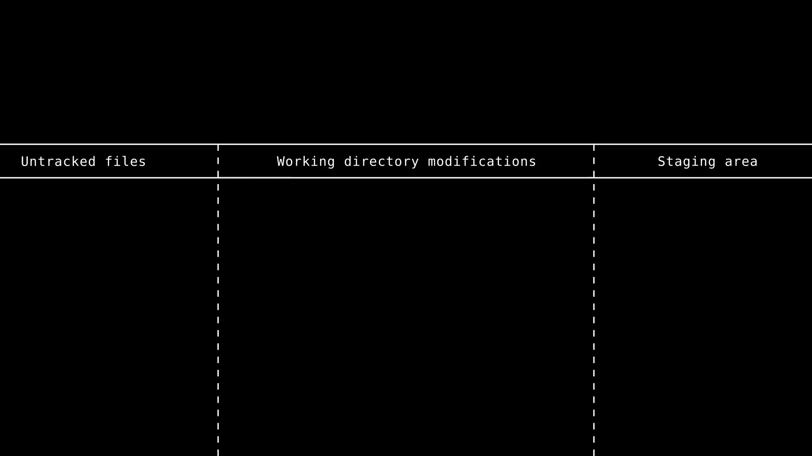
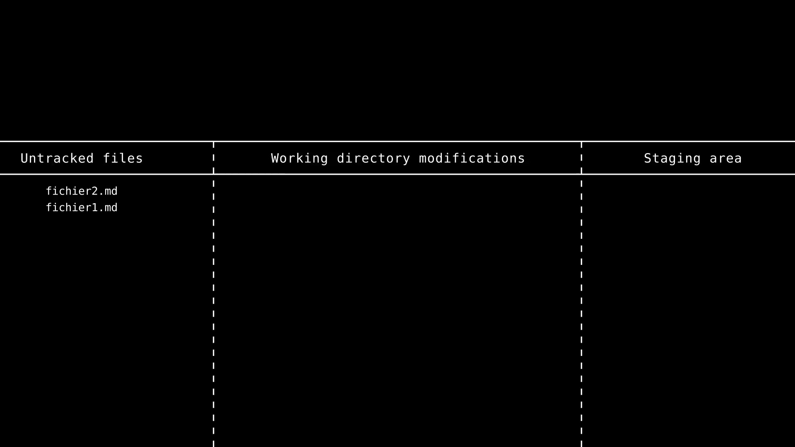
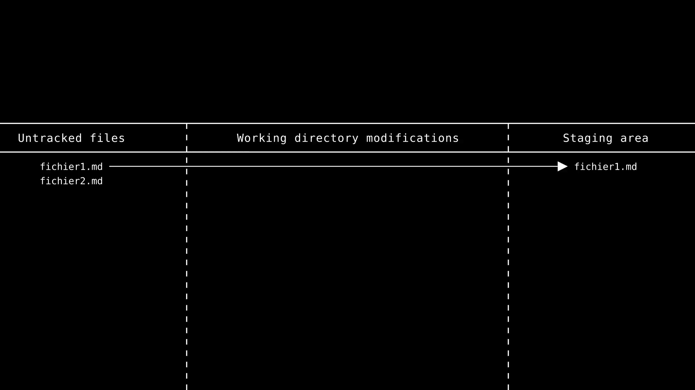
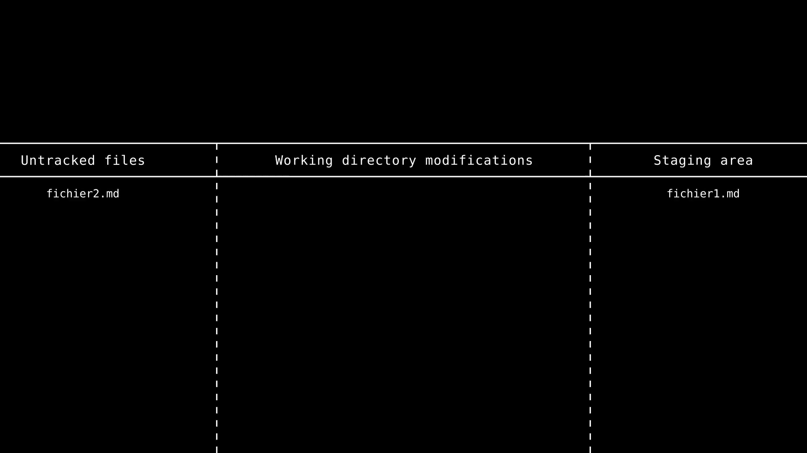
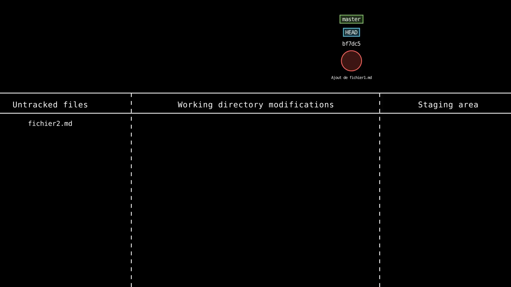
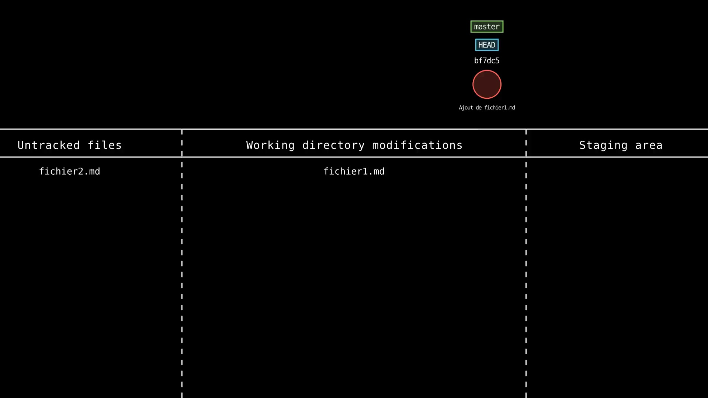
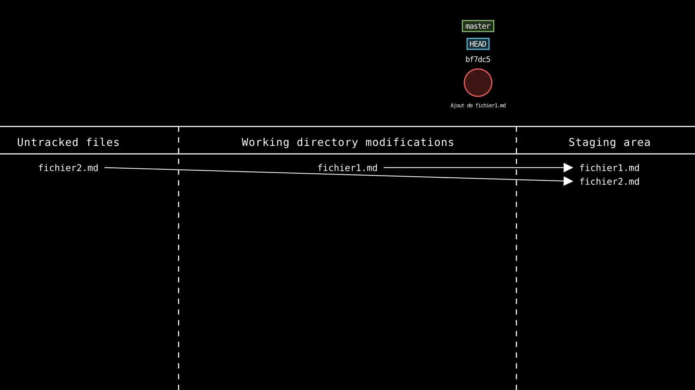
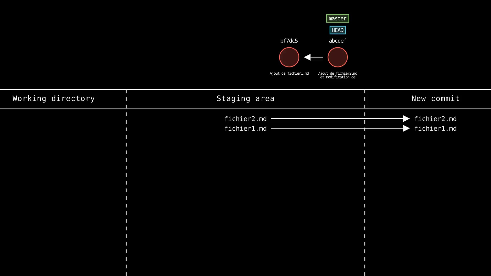

## Partie 1 - Création du dépôt et _commits_

- Ouvrir un terminal (terminal _Git Bash_ à privilégier)
- Créer, en ligne de commande, un répertoire `tp-git`

> Dans les commandes suivantes, le symbole `$` représente le prompt du terminal. Il ne faut pas le taper. Les lignes du dessous, ne commençant pas par `$`, constitue la sortie de la commande, c'est-à-dire son affichage résultant (si elle en produit).

```
$ mkdir tp-git
```

- Se déplacer dans le répertoire

```
$ cd tp-git
```

- Vérifier qu'on est dans le bon répertoire en affichant le chemin du répertoire courant

```
$ pwd
/c/Users/pgahide/.../tp-git
```

- Initialiser un dépôt Git

```
$ git init
Initialized empty Git repository in /.../tp-git/.git/
```

> Le répertoire `.git` a été créé. La présence d'un tel répertoire est un indice que le répertoire englobant est géré par Git. Pour supprimer la gestion de Git tout en préservant le contenu du répertoire de travail, il suffit de supprimer ce répertoire `.git`. Le répertoire englobant n'est alors plus un dépôt Git et il faut refaire un `git init` pour le réinitialiser si on le souhaite.

- Lister tous les fichiers du répertoire (y compris les fichiers cachés) pour s'assurer que le répertoire `.git` à été créé

```
$ ls -a
./  ../  .git/
```

- Ouvrir ce répertoire sous VS Code

```
$ code .
```

> C'est ainsi que l'on ouvre rapidement VS Code sur le répertoire courant en ligne de commande.

- Exécuter `git status` et copier/coller la sortie

```
$ git status
On branch master

No commits yet

nothing to commit (create/copy files and use "git add" to track)
```

> Cela signifie que le dépôt est vide, qu'il n'y a pas encore de _commits_ et que Git ne suit pas les fichiers pour l'instant.

Voici ce que ça donne en « termes Git » :

- les fichiers « *untracked* » sont ceux que Git « voient » mais ne traque pas (c'est-à-dire qu'il ne s'en occupera pas) ;
- les fichiers modifiés du « *working directory* » (répertoire de travail) : ce sont les fichiers que Git surveille et qui ont été modifiés depuis le dernier *commit* ;
- les fichiers « *staged* » sont ceux qui ont été ajoutés à l'index de Git (zone de _Staging_), ce sont ceux qui seront ajoutés au prochain _commit_.



- Créer le fichier `fichier1.md` avec un contenu quelconque et l'enregistrer (vous pouvez utiliser VS Code pour créer et éditer des fichiers)
  - Attention, il s'agit bien de créer un nouveau fichier, et non un répertoire. Il en sera de même tout au long de ce TP.

```
$ echo "contenu quelconque" > fichier1.md
```

> `echo` affiche un texte donné. le `>` _redirige_ l'affichage vers le fichier précisé, ce qui revient ici à créer un fichier `fichier1.md` avec le texte `contenu quelconque`. Ce n'est pas une fonctionnalité Git, c'est est fourni avec le shell Linux (_Git Bash_ simule le shell _Linux Bash_ sur Windows). On pouvait aussi utiliser un éditeur de texte pour obtenir le même résultat, comme précisé.

- Créer le fichier `fichier2.md` avec un contenu quelconque et l'enregistrer

```
$ echo "autre contenu quelconque" > fichier2.md
```

- Exécuter `git status` et copier/coller la sortie

```
git status
On branch master

No commits yet

Untracked files:
  (use "git add <file>..." to include in what will be committed)
        fichier1.md
        fichier2.md

nothing added to commit but untracked files present (use "git add" to track)
```

> Cela signifie que Git a détecté deux nouveaux fichiers, mais qu'il ne les suit pas encore (_untracked_). Git nous indique qu'on peut utiliser `git add` pour les « traquer ».



- Ajouter `fichier1.md` à l'index de Git (zone de _Staging_)

```
$ git add fichier1.md
```

> Le fichier `fichier1.md` est désormais _staged_ (dans l'index). Cela signifie d'une part qu'il sera dans le prochain _commit_, et d'autre part que Git va le « traquer  » (il va surveiller les modifications de ce fichier). Il faudra `add` à chaque fois les fichiers que l'on souhaite faire partie du prochain _commit_.



- Exécuter `git status` et copier/coller la sortie

```
$ git status
On branch master

No commits yet

Changes to be committed:
  (use "git rm --cached <file>..." to unstage)
        new file:   fichier1.md

Untracked files:
  (use "git add <file>..." to include in what will be committed)
        fichier2.md
```

> Git nous signale que `fichier1.md` sera bien dans le prochain _commit_ (il a été _add_ à l'index), mais que `fichier2.md` n'est pas encore traqué (et donc encore moins dans l'index).



- Créer un _commit_ avec pour message : "Ajout de fichier1.md"

```
$ git commit -m "Ajout de fichier1.md"
[master (root-commit) bf7dc53] Ajout de fichier1.md
 1 file changed, 1 insertion(+)
 create mode 100644 fichier1.md
```

> Un _commit_ est un instantané de l'état du dépôt. C'est le concept fondamental sur lequel repose Git. Il est possible à tout moment de revenir à un _commit_ précédent, ce qui revient à revenir à l'état du dépôt à ce moment-là, avec les fichiers exactement tels qu'ils étaient au moment de la « photographie ».

- Exécuter `git status` et copier/coller la sortie

```
$ git status
On branch master
Untracked files:
  (use "git add <file>..." to include in what will be committed)
        fichier2.md

nothing added to commit but untracked files present (use "git add" to track)
```

> Le fichier indexé (`fichier1.md`) n'apparaît plus dans l'index, il a été « photographié », et il n'a pas été modifié depuis. L'illustration suivante nous montre cet état courant, ainsi que le _commit_ représenté sous forme de cercle.



> `master` représente la branche principale du dépôt. C'est la branche par défaut. Il est possible de créer d'autres branches, qui seront des copies de la branche courante à un instant donné. `HEAD` pointe toujours « là où on est actuellement » (branche ou _commit_ précis). `bf7dc53` est l'ID du _commit_ (c'est un _hash_ unique). Parfois on a besoin de désigner un _commit_ par son ID.

- Modifier `fichier1.md` et enregistrer

```
$ echo "modif dans fichier1.md" >> fichier1.md
```

> Légère variation par rapport à la création de fichier : `>>` signifie _append_, c'est-à-dire « ajoute le texte à la fin du fichier existant ».

- Exécuter `git status` et copier/coller la sortie

```
$ git status
On branch master
Changes not staged for commit:
  (use "git add <file>..." to update what will be committed)
  (use "git restore <file>..." to discard changes in working directory)
        modified:   fichier1.md

Untracked files:
  (use "git add <file>..." to include in what will be committed)
        fichier2.md

no changes added to commit (use "git add" and/or "git commit -a")
```

> Git a détecté la modification de `fichier1.md`, mais il nous dit aussi que cette modif n'est pas *staged* : elle ne sera pour l'instant pas dans le prochain _commit_.



- Ajouter `fichier1.md` et `fichier2.md` à la zone de _Staging_

```
$ git add fichier1.md fichier2.md
```

> On peut passer directement plusieurs fichiers à la command `add`. On peut aussi, si on sait qu'on veut vraiment ajouter tous les fichiers qui sont pour l'instant _untracked_ ou modifiés, utiliser la commande raccourcie `git add .`



- Créer un _commit_ "Ajout de fichier2.md et modification de fichier1.md"

```
$ git commit -m "Ajout de fichier2.md et modification de fichier1.md"
[master e4617ae] Ajout de fichier2.md et modification de fichier1.md
 2 files changed, 2 insertions(+)
 create mode 100644 fichier2.md
```



> L'illustration montre que le nouveau _commit_ a pour parent le _commit_ précédent. Git sait toujours quels sont les parents d'un _commit_, pour pouvoir « remonter dans le temps ». On voit aussi que le _commit_ a provoqué l'avancée de la branche `master`, et que `HEAD` pointe également sur ce nouveau _commit_.

- Exécuter `git status` et copier/coller la sortie

```
$ git status
On branch master
nothing to commit, working tree clean
```

> Git nous indique que notre répertoire de travail est complètement en phase avec notre dernier *commit* : plus aucune modification detéctée, plus aucun fichier non-traqué. Le répertoire de travail est « clean ».


- Copier/coller l'ID des deux premiers *commits* :
  - ID _commit_ 1 : `bf7dc53ab71870b89e16a3ed6707433d6215f702`
  - ID _commit_ 2 : `e4617ae8a25612363582c5db6b2334ff4aab8d25`

```
$ git log
commit e4617ae8a25612363582c5db6b2334ff4aab8d25 (HEAD -> master)
Author: pgahide <patrice.gahide@gmail.com>
Date:   Tue Jan 31 18:00:48 2023 +0100

    Ajout de fichier2.md et modification de fichier1.md

commit bf7dc53ab71870b89e16a3ed6707433d6215f702
Author: pgahide <patrice.gahide@gmail.com>
Date:   Tue Jan 31 17:01:28 2023 +0100

    Ajout de fichier1.md
```

> La commande `git log` permet de voir les ID complets des _commits_. Cependant, les 7 premiers caractères de l'ID suffisent en pratique pour identifier de manière unique un _commit_ dans un dépôt.

> `git log` affiche les _commits_ du plus récent au plus ancien. Lorsque l'espace n'est pas suffisant pour tout afficher, la commande entre en mode « visualisation page par page ». Il faut taper `Q` pour en sortir. Plusieurs commandes bien connues du shell Linux se comportent de la même façon lorsqu'un affichage par page est requis.

- Que signifie qu'un fichier est "_tracked_" ou "_untracked_" ?

> Un fichier est surveillé par Git (_tracked_) si Git dès la première fois qu'il est ajouté à l'index. Par la suite, au fur et à mesure des _commits_, Git continue traqué les modifications sur ce fichier. Il vous en informera afin que vous puissiez à nouveau ajouter ces modifications à l'index si vous le souhaitez. Un fichier est _untracked_ si Git ne le surveille pas, c'est-à-dire qu'il ne fait pas partie de la gestion de sources. Un fichier _untracked_ peut être ajouté à l'index à tout moment, et deviendra alors _tracked_. Lorsqu'on sait qu'on ne va jamais rendre certains fichiers _tracked_ (par exemple les fichiers compilés générés lors de l'exécution d'un programme), il est possible de les ignorer en les ajoutant à un fichier `.gitignore`.

- Pourquoi doit-on passer les fichiers par la zone de _Staging_ (l'index) avant de les committer ?

> L'index permet de regrouper plusieurs modifications avant de les committer, sans inclure des modifications qui ne seraient pas pertinentes pour ce _commit_. Cela permet de faire des _commits_ plus cohérents, et de mieux documenter les modifications apportées au projet. Cela permet aussi de faire des _commits_ plus petits, ce qui facilite la lecture des _commits_ et la compréhension des modifications apportées.
