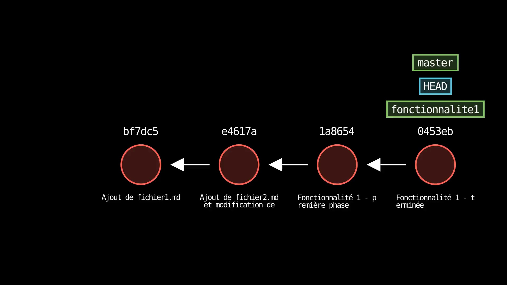
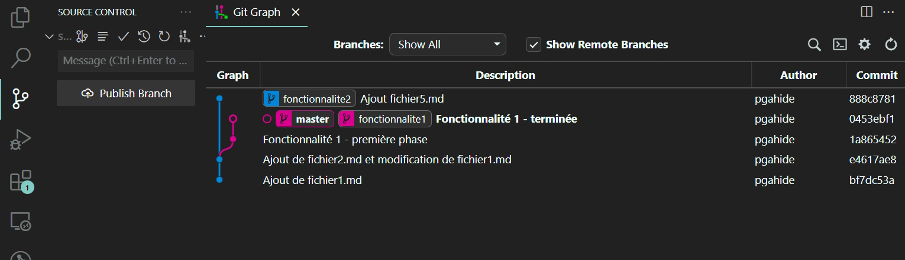
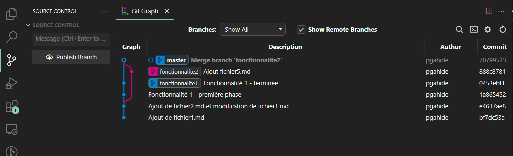
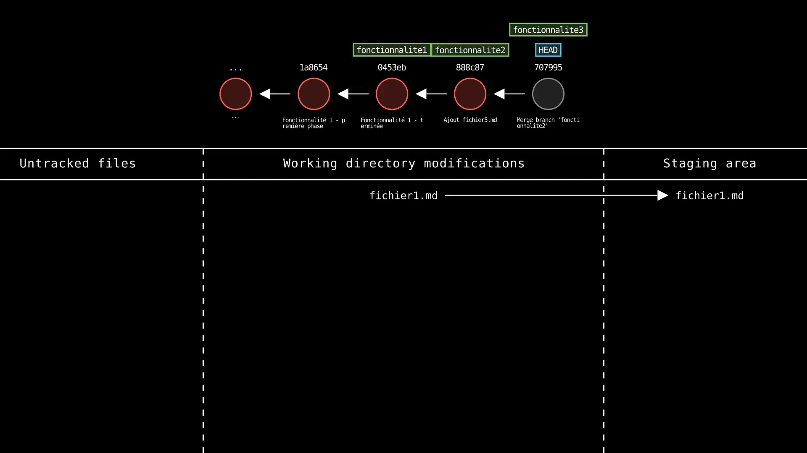
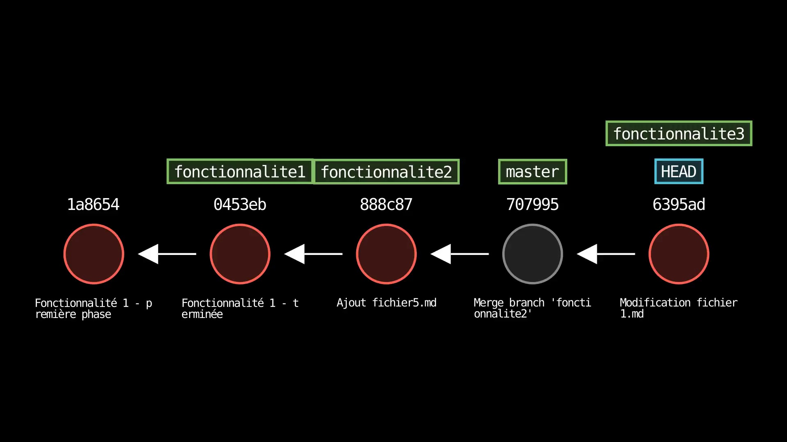
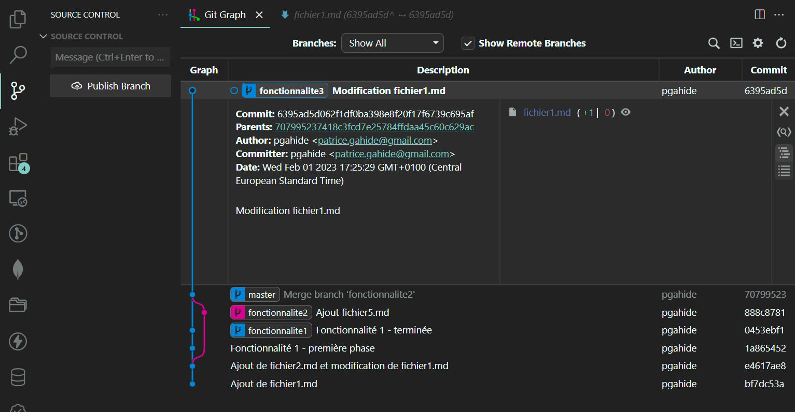
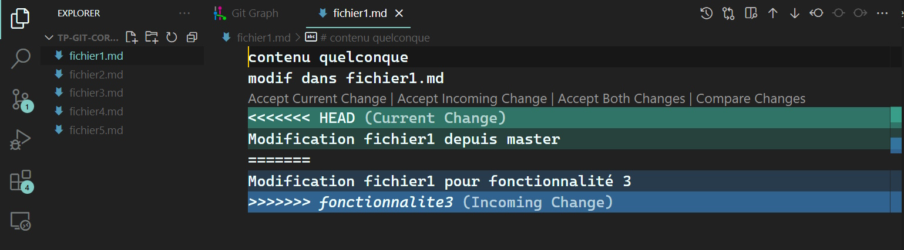
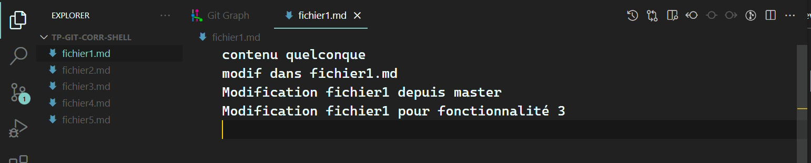
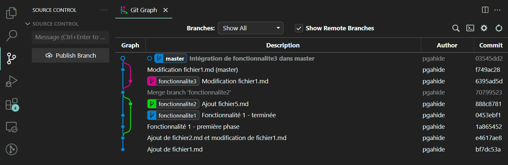
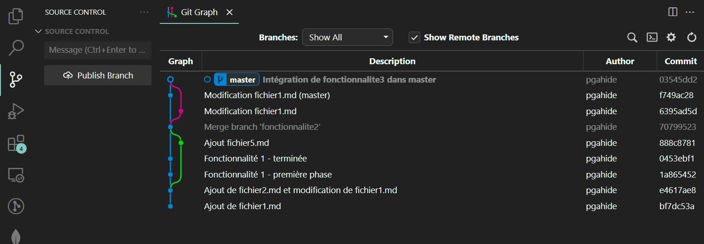

## Partie 3 - Fusionner des branches (_merge_)

_Cette partie est à faire sur le même dépôt que la partie précédente. C'est la suite._

- On considère que la branche originale (`master` ou `main`) est la branche d'intégration, c'est-à-dire celle qui va contenir l'historique de toutes les modifications développées au fur et à mesure dans les branches annexes

> C'est la branche qui va être déployée en production. Il s'agit là d'une convention classique, mais rien n'empêche d'avoir une branche d'intégration autre que `master` ou `main` (par exemple `integration`, `prod`, `stable`...). Différentes façons de gérer les dépôts existent, cela s'appelle des _workflows_ (on parle alors de _Git Workflows_).

- On va maintenant fusionner la branche `fonctionnalite1`, qui est terminée, avec la branche d'intégration
- Se déplacer sur la branche `master`

```
$ git switch master
Switched to branch 'master'
```

> Il faut toujours se placer sur la branche d'intégration (cible) pour fusionner une branche terminée (source).

- Noter le changement dans l'onglet _Git Graph_

> La branche `master` passe en gras.

- Fusionner avec la branche `fonctionnalite1`

```
$ git merge fonctionnalite1
Updating e4617ae..0453ebf
Fast-forward
 fichier2.md | 2 ++
 fichier3.md | 0
 fichier4.md | 1 +
 3 files changed, 3 insertions(+)
 create mode 100644 fichier3.md
 create mode 100644 fichier4.md
```




- Noter le changement dans l'onglet _Git Graph_. Que signifie la mention _Fast-forward_ indiquée par la sortie de la commande ?

<br>



<br>

> Le graphe a la même forme, on voit juste que `master` pointe maintenant sur le même _commit_ que `fonctionnalite1`. La branche `master` a « rattrapé » `fonctionnalite1`, en quelque sorte. Cela n'a pas créé de _commit_ supplémentaire, car rien n'a été committé sur `master` entre-temps, donc aucun conflit n'est possible : il suffit « d'avancer le pointeur ». C'est ce qu'on appelle un _fast-forward_ (« avance rapide »).

- On veut maintenant fusionner `fonctionnalite2` dans la branche d'intégration (`master`)
- Effectuer cette fusion

> _HEAD_ pointe déjà sur `master`, la branche cible de la fusion, mais on peut toujours faire un `git status` pour être certain. Notez que Git Bash, par défaut, affiche aussi la branche sur laquelle on est entre parenthèses à la fin du prompt.

```
$ git merge fonctionnalite2
Merge made by the 'ort' strategy.
 fichier5.md | 1 +
 1 file changed, 1 insertion(+)
 create mode 100644 fichier5.md
```


- Noter le changement dans l'onglet _Git Graph_. Que signifie la mention _Merge made by the ... strategy_ indiquée par la sortie de la commande ?

<br>



<br>

> Cette fois un nouveau _commit_ a été effectué pour la fusion. Git ne pouvait pas juste « avancer le pointeur » (_fast-forward_) parce que les deux branches ont un historique différent depuis leur ancêtre commun (le _commit_ `e4617a`). Il a donc dû créer un nouveau _commit_ pour fusionner les deux branches, qui sont maintenant « rejointes ». En revanche, il a pu se débrouiller seul pour inclure les deux historiques de _commits_, car les fichiers impliqués ne sont pas les mêmes sur les deux branches. Il s'est donc contenté d'inclure toutes les modifications sans que cela ne pose de problème. Il a pour cela utilisé une stratégie de fusion automatique simple appelée _ort_ (« ortogonale »). Parfois, Git ne peut pas se débrouiller tout seul, et il faut alors résoudre les conflits manuellement.

- Quelle est la différence fondamentale avec la fusion précédente ?

> Ici, un nouveau _commit_ a été créé pour intégrer l'ensemble des modifications des deux branches. Ce n'était pas nécessaire dans la fusion précédente.

- Créer une nouvelle branche `fonctionnalite3`, se déplacer dessus, et modifier le fichier `fichier1.md` en y ajoutant une ligne de texte. Committer : "Modification fichier1 pour fonctionnalité 3"

```
$ git switch -c fonctionnalite3
Switched to a new branch 'fonctionnalite3'
```

> L'option `-c` de la commande `git switch` permet de créer une nouvelle branche et de se déplacer dessus en une seule commande. Ci-dessous, on insère de nouveau les illustrations de l'état du système Git au fur et à mesure des commandes pour bien comprendre ce qui se passe.

```
$ echo "Modification fichier1 pour fonctionnalité 3" >> fichier1.md
$ git status
On branch fonctionnalite3
Changes not staged for commit:
  (use "git add <file>..." to update what will be committed)
  (use "git restore <file>..." to discard changes in working directory)
        modified:   fichier1.md

no changes added to commit (use "git add" and/or "git commit -a")
```

> Ici, Git a détecté que `fichier1.md` a été modifié. C'est un fichier qui était déjà traqué, donc il est directement listé comme une modification connue. Cependant, ce n'est pas parce qu'il faisait partie d'un précédent _commit_ qu'il est automatiquement indexé. (_staged_). Git attend de savoir si c'est vraiment ce que vous voulez :


```
$ git add fichier1.md
```



> Cette fois le fichier est indexé, et il est prêt à être committé si on le souhaite.

```
$ git commit -m "Modification fichier1.md"
[fonctionnalite3 6395ad5] Modification fichier1.md
 1 file changed, 1 insertion(+)
```




- Comment utiliser _Git Graph_ pour qu'il nous montre les différences entre l'ancienne version de `fichier1.md` et la version courante que l'on vient de committer ?

> Cliquer sur un _commit_ dans Git Graph nous montre les détails du _commit_, avec la liste des fichiers modifiés sur la droite :

<br>



<br>

> Cliquer sur un fichier nous montre le _diff_ entre la version du fichier dans le _commit_ et la version du _commit_ précédent :

<br>


<br>

- Repartir sur `master`, et modifier `fichier1.md` en y ajoutant aussi une ligne (différente de celle qu'on a ajoutée sur l'autre branche) ; ajouter à l'index et _commit_

```
$ git switch master
Switched to branch 'master'
$ echo "Modification fichier1 depuis master" >> fichier1.md
$ git add fichier1.md
$ git commit -m "Modification fichier1.md (master)"
[master f749ac2] Modification fichier1.md (master)
 1 file changed, 1 insertion(+)
```


> Le fichier `fichier1.md` a donc été modifié sur les deux branches (`fonctionnalite3` et `master`), depuis une base commune, mais avec des modifications différentes. Cela va créer un conflit lors de la fusion des deux branches.

- Tenter de fusionner la branche `fonctionnalite3` avec `master`
  - Que se passe-t-il et pourquoi ?

```
$ git merge fonctionnalite3
Auto-merging fichier1.md
CONFLICT (content): Merge conflict in fichier1.md
Automatic merge failed; fix conflicts and then commit the result.
```

> Git a détecté un conflit, et a interrompu la fusion. Il nous indique le fichier en conflit (il se peut bien sûr qu'il y en ait plusieurs), et nous demande de le résoudre (manuellement) avant de committer (également manuellement).

- Lancer un `git status`

```
$ git status
On branch master
You have unmerged paths.
  (fix conflicts and run "git commit")
  (use "git merge --abort" to abort the merge)

Unmerged paths:
  (use "git add <file>..." to mark resolution)
        both modified:   fichier1.md

no changes added to commit (use "git add" and/or "git commit -a")
```

> Git nous indique bien que nous avons des « chemins non-fusionnés » (_unmerged paths_) à cause d'un fichier qui a été modifié des deux côtés (_both modified: fichier1.md_) et nous demande de résoudre le conflit (_fix conflicts_) avant de pouvoir committer.

- Que doit-on faire si on veut annuler la fusion en cours ? (**ne pas lancer la commande**)

> Il peut arriver que la fusion ne soit pas évidente, ou non souhaitée. Il se peut aussi, lorsque cela nous arrive en tant que débutant, que l'on panique un peu à l'idée de faire une bêtise. Dans ce cas, il est possible d'annuler la fusion en cours. Cela nous donne le temps d'en parler avec les collègues et de trouver une solution. Git nous indique la commande à lancer dans ce cas : `git merge --abort`

- On veut résoudre le conflit. Plusieurs possibilités :

  - Conserver uniquement les modifications faites dans `fonctionnalite3`
  - Conserver uniquement les modifications faites dans `master`
  - Conserver les deux modifications
  - Supprimer les deux modifications ou remanier sensiblement le fichier pour les intégrer correctement

- Git nous laisse totalement la main et ne va pas essayer d'imposer l'un de ces choix pour nous, ni nous assister dans l'application automatique de l'un d'entre eux : il faut examiner le(s) fichier(s) en conflit et éditer nous-mêmes

> En fait, on fait exactement ce qu'on veut ! Git veut juste qu'on lui dise quand on a fini. C'est le prochain _commit_ qui va lui donner ce signal.

- Ouvrir le fichier en question sous VS Code

  - La chaîne `<<<<<<<<<<` marque le début du conflit
  - La chaîne `>>>>>>>>>>` marque la fin du conflit
  - La chaîne `==========` sépare les deux versions

<br>



<br>

> On voit ici que le conflit se situe sur les lignes qui ont été ajoutées depuis les deux branches. En vert, on voit ce qui se passe sur `master` (_Current Change_). En bleu, c'est la version de `fonctionnalite3` (que l'on essaie de fusionner : _Incoming Changes_). Tous les symboles ajoutés ne sont que du texte destiné à nous guider. Il faut « nettoyer » le fichier pour enlever ces symboles et ne garder que les modifications que l'on souhaite conserver.

- Éditer le fichier pour faire en sorte d'intégrer les deux modifications ; à la fin de l'édition :
  - Il ne doit plus y avoir de marques quelconques en dehors des ajouts fonctionnels originaux, c'est-à-dire pas de `<<<<<<<<<<`, ni de mentions de nom de branche, etc. : vous rendez le fichier tel qu'il doit apparaître dans le _commit_ de fusion, avec les conflits résolus manuellement
  - Sauvegarder

<br>



<br>

- Ajouter les modification à l'index et committer

```
$ git add fichier1.md
$ git commit -m "Intégration de fonctionnalite3 dans master"
[master 03545dd] Intégration de fonctionnalite3 dans master
```

<br>



<br>

> Les deux branches `master` et `fonctionnalite3` se sont rejointes au sein d'un nouveau _commit_, comme dans la fusion précédente. La seule différence est qu'ici, on a dû résoudre un conflit et effectuer le _commit_ nous-mêmes.

- NB : parfois, plusieurs fichiers sont en conflit ; le processus est identique, il faut juste résoudre les conflits sur tous les fichiers puis committer
- NB : les conflits de fusion sont fréquents lorsqu'on travaille en collaboration (plusieurs personnes vont travailler sur le même fichier pour remplir deux fonctionnalités différentes)
- Les branches créées n'ont plus de raison d'exister
  - Elles avaient pour but de créer une déviation afin de travailler sur des fonctionnalités individuelles, sans interférer avec le travail des autres, avant de les fusionner dans la branche d'intégration
  - On va vouloir nettoyer le dépôt en les supprimant
  - Cela ne va bien sûr pas supprimer tous les _commits_ qui y sont associés
  - Attention cependant d'éviter en général de supprimer une branche qui n'a pas encore été intégrée à la branche d'intégration, sauf si on souhaite vraiment abandonner le développement de cette branche
  - Ne pas réutiliser une branche qui a déjà été intégrée pour démarrer une nouvelle piste : toujours utiliser une nouvelle branche
  - Nouvelle tâche ? => nouvelle branche à partir d'un _commit_ de la branche d'intégration (en général le plus récent)
  - Tâche terminée ? => fusion dans la branche d'intégration et suppression de la branche
- Supprimer les trois branches `fonctionnalitex` (attention : on ne peut pas supprimer une branche sur laquelle on est)

```
$ git branch -d fonctionnalite1 fonctionnalite2 fonctionnalite3
Deleted branch fonctionnalite1 (was 0453ebf).
Deleted branch fonctionnalite2 (was 888c878).
Deleted branch fonctionnalite3 (was 6395ad5).
```

<br>



<br>

> La branche d'intégration `master` reste la seule branche présente dans le dépôt. Ce n'est pas pour autant que tous les _commits_ associés aux branches ont disparus. Ils sont tous ancêtres de `master`, et restent accessibles depuis cette branche. On pourra ainsi examiner tout l'historique au besoin.
