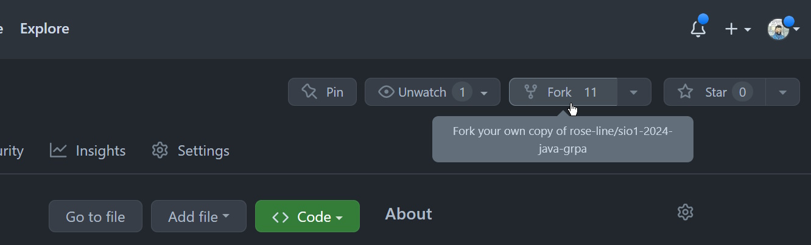
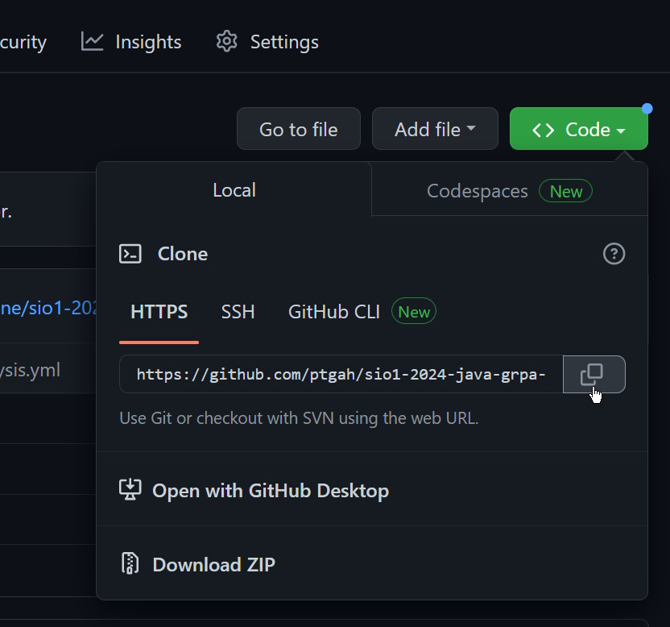
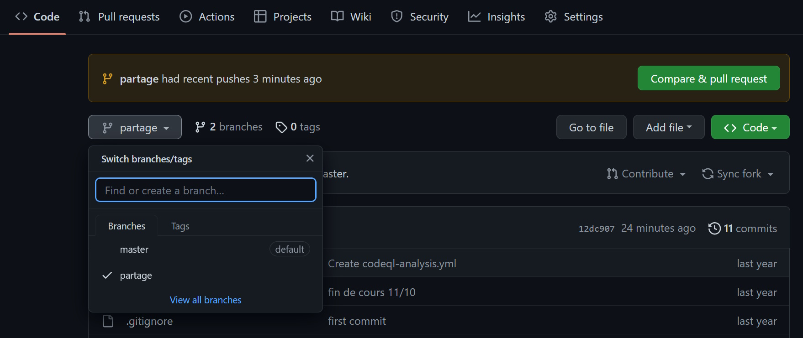
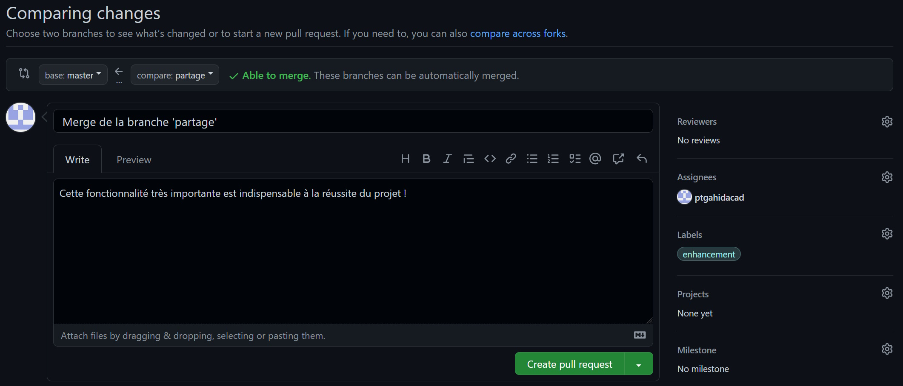
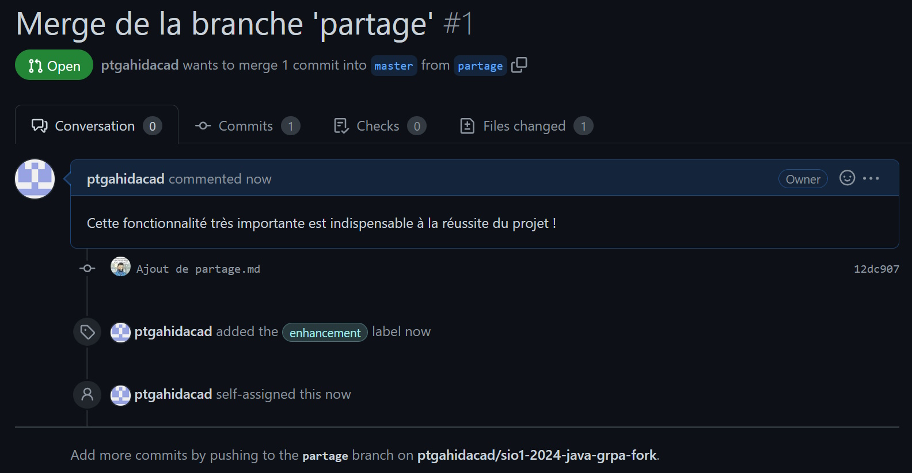
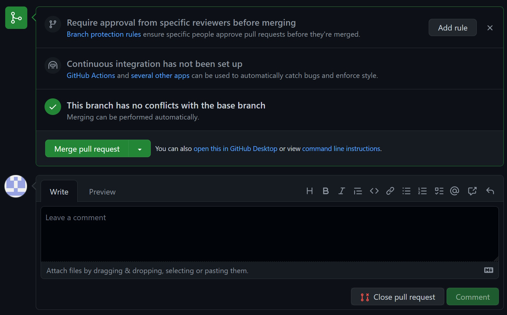
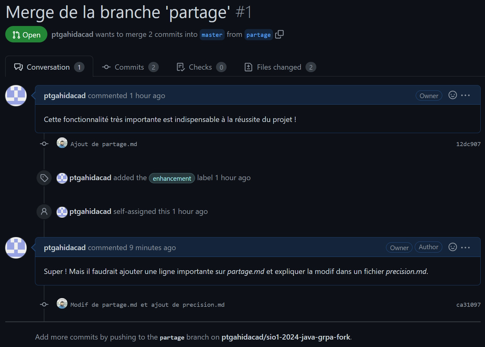
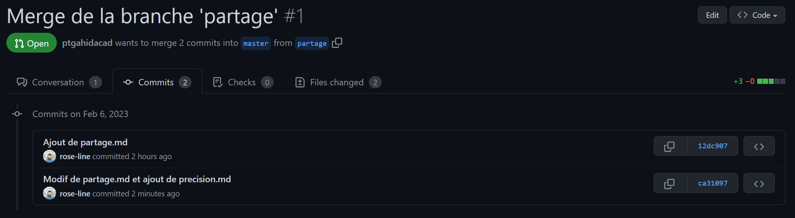

## Partie 4 - Travailler avec un hébergeur Git distant

- Faire un _fork_ du dépôt https://github.com/rose-line/sio1-2024-java-grpa (pas par commande Git, c'est sur l'interface GitHub)

> Localiser le bouton _fork_ sur la page du dépôt.

<br>



<br>

- Cloner localement votre _fork_ (**ne pas cloner le dépôt original**)

> Il faut d'abord récupérer l'URL du dépôt distant. Pour cela, il faut aller sur la page de votre dépôt, puis cliquer sur le bouton _Code_ et copier l'URL qui s'affiche.

<br>



<br>

```
$ cd /.../mon_dossier_de_projets
$ git clone https://github.com/<mon-compte-github>/sio1-2024-java-grpa-fork.git tp-git-4
Cloning into 'tp-git-4'...
remote: Enumerating objects: 47, done.
remote: Counting objects: 100% (6/6), done.
remote: Total 47 (delta 5), reused 5 (delta 5), pack-reused 41
Receiving objects: 100% (47/47), 8.50 KiB | 322.00 KiB/s, done.
Resolving deltas: 100% (8/8), done.
```

- Quelle est la différence entre un _fork_ et un clonage ?

> Un **_fork_** est une copie d'un dépôt distant sur votre compte distant (votre compte GitHub). Un **clonage** est une copie d'un dépôt distant en local (sur votre machine).

- Indiquer dans quelles circonstances on voudrait _forker_ et/ou cloner un dépôt

> On _fork_ un dépôt quand on veut contribuer à un projet sans avoir les droits d'écriture sur le dépôt original. On clone un dépôt quand on veut travailler sur une copie locale du dépôt.

- Modifier le fichier `README.md` à la racine du dépôt en ajoutant une ligne quelconque

```
$ cd sio1-2024-java-grpa-fork
$ echo "Modification de README.md" >> README.md
```

- On veut maintenant envoyer cette modification vers le dépôt distant
- Il faut d'abord faire un _add/commit_ local

```
$ git add README.md
$ git commit -m "Modification de README.md"
[master fd98cae] Modification de README.md
 1 file changed, 1 insertion(+), 1 deletion(-)
```

- Puis utiliser la commande qui « pousse » les modifs sur le dépôt GitHub (_push_)

```
$ git push
Enumerating objects: 5, done.
Counting objects: 100% (5/5), done.
Delta compression using up to 16 threads
Compressing objects: 100% (2/2), done.
Writing objects: 100% (3/3), 312 bytes | 156.00 KiB/s, done.
Total 3 (delta 1), reused 0 (delta 0), pack-reused 0
remote: Resolving deltas: 100% (1/1), completed with 1 local object.
To github.com:moncomptegithub/sio1-2024-java-grpa-fork.git
   9edb2da..fd98cae  master -> master
```

- Vérifier directement sur GitHub que le _push_ a bien fonctionné

> Sur le dépôt distant, on voit immédiatement que le dernir commit a modifié le fichier `README.md`. La consultation du fichier sur l'interface GitHub nous montre la modification.

- Trouver la commande qui affiche le nom du ou des dépôt(s) distant(s) relié(s) avec le dépôt local : cela permet de savoir si le dépôt courant est synchronisé avec un dépôt en ligne ou non

```
$ git remote
origin
$ git remote -v
origin  git@github.com:moncomptegithub/sio1-2024-java-grpa-fork.git (fetch)
origin  git@github.com:moncomptegithub/sio1-2024-java-grpa-fork.git (push)
```

> On a deux sorties correspondant au même *remote* : `fetch` (pour récupérer) et `push` (pour envoyer).

- On va faire un _merge_ en local puis *push* :
  - Créer une branche locale `bugfix1`, se déplacer dessus, créer un nouveau fichier `ok.java` à la racine du dépôt

```
$ git switch -c bugfix1
Switched to a new branch 'bugfix1'
$ echo "public class ok {}" > ok.java
```

- Ajouter `ok.java` à l'index et faire un _commit_

```
$ git add ok.java
$ git commit -m "Ajout de ok.java"
[bugfix1 36d6366] Ajout de ok.java
 1 file changed, 1 insertion(+)
 create mode 100644 ok.java
```

- Retourner sur `master`, créer le fichier `ajout.java`, ajouter à l'index et _commit_

```
$ git switch master
Switched to branch 'master'
Your branch is up to date with 'origin/master'.
$ echo "public class ajout {}" > ajout.java
$ git add ajout.java
$ git commit -m "Ajout de ajout.java"
[master cc80460] Ajout de ajout.java
 1 file changed, 1 insertion(+)
 create mode 100644 ajout.java
```

- Fusionner la branche `bugfix1` dans la branche `master`

```
$ git merge bugfix1
Merge made by the 'ort' strategy.
 ok.java | 1 +
 1 file changed, 1 insertion(+)
 create mode 100644 ok.java
```

> L'éditeur de texte par défaut s'ouvre pour nous permettre de modifier le message de _commit_ du _merge_. On peut le laisser tel quel, sauvegarder et quitter. Aucun conflit n'est détecté, Git peut inclure toute les modifications automatiquement dans le nouveau _commit_.

- Afficher le log des *commits* ; noter les emplacements des trois branches différentes, en local et en remote

```
$ git log --oneline --graph
*   a9eada1 (HEAD -> master) Merge branch 'bugfix1'
|\
| * 36d6366 (bugfix1) Ajout de ok.java
* | cc80460 Ajout de ajout.java
|/
* fd98cae (origin/master, origin/HEAD) Modification de README.md
...
```

> La branche `master` vient d'accueillir la fusion avec `bugfix1` : elle est la branche « la plus à jour », pointant sur le _commit_ a9eada1. La branche `bugfix1` a été fusionnée mais n'a pas bougée : elle va pouvoir être supprimée. La branche `master` sur le _remote_ (`origin/master`) est « en retard » : elle n'a pas connaissance des deux _commits_ qui ont été faits sur la branche `master` locale.

- Faire un _push_

```
$ git push
Enumerating objects: 9, done.
Counting objects: 100% (9/9), done.
Delta compression using up to 16 threads
Compressing objects: 100% (6/6), done.
Writing objects: 100% (8/8), 683 bytes | 227.00 KiB/s, done.
Total 8 (delta 4), reused 0 (delta 0), pack-reused 0
remote: Resolving deltas: 100% (4/4), completed with 1 local object.
To github.com:moncomptegithub/sio1-2024-java-grpa-fork.git
   fd98cae..a9eada1  master -> master
```

- Refaire un affichage du log ; `origin/master` a bougé : que représente cette branche ?

```
$ git log --oneline --graph
*   a9eada1 (HEAD -> master, origin/master, origin/HEAD) Merge branch 'bugfix1'
|\
| * 36d6366 (bugfix1) Ajout de ok.java
* | cc80460 Ajout de ajout.java
|/
* fd98cae Modification de README.md
...
```

> La branche `origin/master`, qui correspond à la branche `master` du dépôt _remote_ sur GitHub, a « rejoint » la branche locale `master` : elle pointe sur le même _commit_. C'est la conséquence du _push_.

- Étudier le résultat sur GitHub, en examinant _commits_ et branches (bouton _drop-down_ sur la page du dépôt pour voir les branches) : qu'est-ce qui est différent de la version locale ?

> La branche `bugfix1` est inexistante sur le _remote_, ainsi que les _commits_ qui ont été faits dessus (cc80460 et 26d6366). Lorsque l'on fait un _push_, seule la branche courante est envoyée : ici, la branche `master`. Il faut faire un _push_ explicite de la branche `bugfix1` si l'on souhaite vraiment qu'elle soit envoyée sur le _remote_.

- Le bug est corrigé et intégré ; que doit-on faire de la branche `bugfix1` maintenant ?

> Il faut la supprimer : elle n'est plus utile. On rappelle que cela ne supprime pas les _commits_ qui ont été faits sur cette branche, mais seulement le pointeur qui désigne la branche.

```
$ git branch -d bugfix1
Deleted branch bugfix1 (was 36d6366).
```

- Supposons que l'on veuille effectivement publier sur le _remote_ une branche sur laquelle on travaille (pour sauvegarde ou pour que d'autres puissent l'utiliser)
  - Créer une nouvelle branche `partage`
  - Aller sur la branche

```
$ git switch -c partage
Switched to a new branch 'partage'
```

- Ajouter un fichier `partage.md`
- L'inclure dans l'index
- Faire un _commit_

```
$ echo "Contenu pour le fichier" > partage.md
$ git add partage.md
$ git commit -m "Ajout de partage.md"
[partage 12dc907] Ajout de partage.md
 1 file changed, 1 insertion(+)
 create mode 100644 partage.md
```

- _Push_

```
$ git push
fatal: The current branch partage has no upstream branch.
To push the current branch and set the remote as upstream, use

    git push --set-upstream origin partage
```

- Que se passe-t-il ?

> Un message d'erreur est renvoyé : le _remote_ ne connaît pas la branche `partage`. Il faut indiquer explicitement à Git que l'on veut la créer (_upstream branch_). Git propose la commande à exécuter : `git push --set-upstream origin partage`

- Exécuter la bonne commande pour sauvegarder la branche sur le remote

```
$ git push --set-upstream origin partage
Enumerating objects: 4, done.
Counting objects: 100% (4/4), done.
Delta compression using up to 16 threads
Compressing objects: 100% (2/2), done.
Writing objects: 100% (3/3), 293 bytes | 293.00 KiB/s, done.
Total 3 (delta 1), reused 0 (delta 0), pack-reused 0
remote: Resolving deltas: 100% (1/1), completed with 1 local object.
remote:
remote: Create a pull request for 'partage' on GitHub by visiting:
remote:      https://github.com/ptgahidacad/sio1-2024-java-grpa-fork/pull/new/partage
remote:
To github.com:ptgahidacad/sio1-2024-java-grpa-fork.git
 * [new branch]      partage -> partage
Branch 'partage' set up to track remote branch 'partage' from 'origin'.
```

- Vérifier sur GitHub que la branche apparaît bien



> On voit bien la branche `partage` listée au côté de `master`. Lorsqu'on clique dessus, on retrouve notre fichier `partage.md` qui est absent de `master`. La branche a donc été correctement « poussée ».

- La branche `partage` n'a pas été fusionnée avant le *push* ; on va utiliser un autre moyen offert par GitHub pour fusionner une branche en *remote* : la **_Pull Request_**
  - La _Pull Request_ est très utilisée en collaboration : elle permet à l'intégrateur du projet d'examiner les demandes de _merge_ au niveau du _remote_ avant de les accepter (ou non)
- Sur GitHub, cliquer sur le bouton _Compare & pull request_, qui apparaît directement sur la page du dépôt depuis le dernier _push_ qui a ajouté la branche (voir ci-dessus).

- À gauche, la branche d'intégration (« *base* », qui reçoit le _merge_) ; à droite, la branche à fusionner (« *compare* »)

  - On doit fusionner `partage` dans `master`
  - Attention, il faut bien choisir le repo de base qui est sur votre propre compte (pas le compte du dépôt d'origine que vous avez _forké_)
  - On peut ajouter d'autres informations : titre et commentaire de la _pull request_, et même upload de fichiers annexes, liens éventuels... Également, on peut ajouter des labels pour étiquetter la _pull request_ et lui affecter un _reviewer_, qui va officiellement être en charge
  - Valider en cliquant sur le bouton _Create pull request_



- La page résultante informe sur les branches source et cible, sur les _commits_ concernés, les fichiers qui ont été modifiés...



- On peut aussi y démarrer une conversation notamment entre l'émetteur de la _pull request_ et l'intégrateur
- On voit que l'intégrateur (possesseur du compte cible) peut accepter la _pull request_ en cliquant sur le bouton _Merge pull request_ (ou refuser en cliquant sur _Close pull request_).



- En discutant de la _pull request_, on se rend compte que certaines choses devraient être modifiées. On va repartir faire les modifications en local, puis _push_ de nouveau comme nous le suggère GitHub («  *Add more commits by pushing to the partage branch on ptgahidacad/sio1-2024-java-grpa-fork* »).


- Repartir en local pour effectuer une modification sur `partage.md` et ajouter `precision.md`
- _Commit_ des deux modifs
- _Push_

```
$ echo "Ligne importante" >> partage.md
$ echo "Ceci est une précision" > precision.md
$ git add partage.md precision.md
$ git commit -m "Modif de partage.md et ajout de precision.md"
[partage ca31097] Modif de partage.md et ajout de precision.md
 2 files changed, 2 insertions(+)
 create mode 100644 precision.md
$ git push
Enumerating objects: 6, done.
Counting objects: 100% (6/6), done.
Delta compression using up to 16 threads
Compressing objects: 100% (2/2), done.
Writing objects: 100% (4/4), 398 bytes | 199.00 KiB/s, done.
Total 4 (delta 1), reused 0 (delta 0), pack-reused 0
remote: Resolving deltas: 100% (1/1), completed with 1 local object.
To github.com:moncomptegithub/sio1-2024-java-grpa-fork.git
   12dc907..ca31097  partage -> partage
```

- Observer la *pull request* : que s'est-il passé ?

> Il faut rafraîchir la page. Sur l'onglet _Conversation_, on voit que GitHub nous a informé que nous avons ajouté un _commit_ à la branche `partage` et que nous avons donc modifié la *pull request* :



> L'onglet _commits_ nous montre l'historique des _commits_ de la branche `partage`, que nous souhaitons fusionner en _remote_ dans la branche d'intégration.



- Finalement, faire le _merge_ sur la page de la _pull request_

> On cliquer sur le bouton _Merge pull request_. Cela va créer un nouveau _commit_, comme lorsque l'on fusionne en local. GitHub nous propose comme alternatives le _squash_ (fusionner tous les _commits_ en un seul) ou le _rebase_ (fusionner les _commits_ en les replaçant sur la branche d'intégration : on ne verrait ainsi pas la « déviation » de la branche `partage`).


- Noter que l'interface nous propose alors de supprimer la branche devenue inutile ; supprimer la branche

- Dans un contexte de travail en collaboration sur un même dépôt, donner un _workflow_ (façon de travailler) possible qui va permettre à tous les intervenants de viser des ajouts à la branche d'intégration, d'en discuter, et ceci sans danger pour la branche d'intégration, avant que finalement l'intégrateur (probablement propriétaire du dépot) accepte les changements.

> On peut imaginer un _workflow_ comme suit :
>
> - Chaque membre du groupe travaille sur sa branche, et propose des _pull requests_ pour fusionner ses modifications dans la branche d'intégration.
> - L'intégrateur peut alors accepter ou refuser les _pull requests_.
> - Si l'intégrateur accepte une _pull request_, il peut soit faire une fusion classique, soit fusionner les _commits_ en un seul, soit les rebaser sur la branche d'intégration.
> - Si l'intégrateur refuse une _pull request_, il peut laisser un commentaire pour expliquer pourquoi. Le membre du groupe peut continuer à travailler sur sa branche de travail pour faire les corrections demandées, et proposer une nouvelle _pull request_ en poussant ses modifications.
> - Dans tous les cas, l'intégrateur peut supprimer la branche de travail.

> On s'assure ainsi que la branche d'intégration ne contient que des modifications validées par l'intégrateur.
